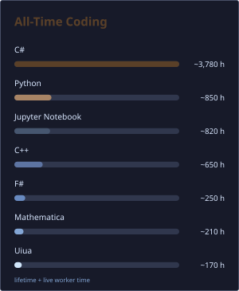

  
  
  
  
  
  
  

  
  
  
  
  
  
  

  
  
  
  
  
  
  

  
  
  
  
  

  
  
  
  
  
  

  
  
  
  

  
  
  

  
  

<!--

-->

  
  
  
  

  
  
  
  

  

  

<!--&include_repo=Ural_CS
-->
# Lets play Chess!
<!-- BEGIN CHESS BOARD -->
|   | A | B | C | D | E | F | G | H |   |
|---|:-:|:-:|:-:|:-:|:-:|:-:|:-:|:-:|:-:|
| **8** |  |  |  |  |  |  |  |  | **8** |
| **7** |  |  |  |  |  |  |  |  | **7** |
| **6** |  |  |  |  |  |  |  |  | **6** |
| **5** |  |  |  |  |  |  |  |  | **5** |
| **4** |  |  |  |  |  |  |  |  | **4** |
| **3** |  |  |  |  |  |  |  |  | **3** |
| **2** |  |  |  |  |  |  |  |  | **2** |
| **1** |  |  |  |  |  |  |  |  | **1** |
|   | **A** | **B** | **C** | **D** | **E** | **F** | **G** | **H** |   |
<!-- END CHESS BOARD -->

**It's your turn to move! Choose one from the following table by clicking a linked move, them just submitt the issue without changing anything!**
**And you're good to go!**
<!-- BEGIN MOVES LIST -->
<table>
  <thead>
    <tr>
      <th align="center">PIECE / FROM</th>
      <th align="center">LEGAL DESTINATIONS — click to move</th>
    </tr>
  </thead>
  <tbody>
    <tr>
      <td align="center">
         
        <strong>A8</strong>
      </td>
      <td>
        <table>
          <tbody>
            <tr>
              <td align="center" width="72"><a href="https://github.com/RusMermaid/RusMermaid/issues/new?body=Please+do+not+change+the+title.+Just+click+%22Submit+new+issue%22.+You+don%27t+need+to+do+anything+else+%3AD&amp;title=Chess%3A+Move+A8+to+A5" title="Move black rook from A8 to A5"> <strong>A5</strong></a></td>
              <td align="center" width="72"><a href="https://github.com/RusMermaid/RusMermaid/issues/new?body=Please+do+not+change+the+title.+Just+click+%22Submit+new+issue%22.+You+don%27t+need+to+do+anything+else+%3AD&amp;title=Chess%3A+Move+A8+to+A6" title="Move black rook from A8 to A6"> <strong>A6</strong></a></td>
              <td align="center" width="72"><a href="https://github.com/RusMermaid/RusMermaid/issues/new?body=Please+do+not+change+the+title.+Just+click+%22Submit+new+issue%22.+You+don%27t+need+to+do+anything+else+%3AD&amp;title=Chess%3A+Move+A8+to+A7" title="Move black rook from A8 to A7"> <strong>A7</strong></a></td>
              <td align="center" width="72"><a href="https://github.com/RusMermaid/RusMermaid/issues/new?body=Please+do+not+change+the+title.+Just+click+%22Submit+new+issue%22.+You+don%27t+need+to+do+anything+else+%3AD&amp;title=Chess%3A+Move+A8+to+B8" title="Move black rook from A8 to B8"> <strong>B8</strong></a></td>
            </tr>
          </tbody>
        </table>
      </td>
    </tr>
    <tr>
      <td align="center">
         
        <strong>B5</strong>
      </td>
      <td>
        <table>
          <tbody>
            <tr>
              <td align="center" width="72"><a href="https://github.com/RusMermaid/RusMermaid/issues/new?body=Please+do+not+change+the+title.+Just+click+%22Submit+new+issue%22.+You+don%27t+need+to+do+anything+else+%3AD&amp;title=Chess%3A+Move+B5+to+B4" title="Move black pawn from B5 to B4"> <strong>B4</strong></a></td>
            </tr>
          </tbody>
        </table>
      </td>
    </tr>
    <tr>
      <td align="center">
         
        <strong>C6</strong>
      </td>
      <td>
        <table>
          <tbody>
            <tr>
              <td align="center" width="72"><a href="https://github.com/RusMermaid/RusMermaid/issues/new?body=Please+do+not+change+the+title.+Just+click+%22Submit+new+issue%22.+You+don%27t+need+to+do+anything+else+%3AD&amp;title=Chess%3A+Move+C6+to+C5" title="Move black pawn from C6 to C5"> <strong>C5</strong></a></td>
            </tr>
          </tbody>
        </table>
      </td>
    </tr>
    <tr>
      <td align="center">
         
        <strong>C8</strong>
      </td>
      <td>
        <table>
          <tbody>
            <tr>
              <td align="center" width="72"><a href="https://github.com/RusMermaid/RusMermaid/issues/new?body=Please+do+not+change+the+title.+Just+click+%22Submit+new+issue%22.+You+don%27t+need+to+do+anything+else+%3AD&amp;title=Chess%3A+Move+C8+to+A6" title="Move black bishop from C8 to A6"> <strong>A6</strong></a></td>
              <td align="center" width="72"><a href="https://github.com/RusMermaid/RusMermaid/issues/new?body=Please+do+not+change+the+title.+Just+click+%22Submit+new+issue%22.+You+don%27t+need+to+do+anything+else+%3AD&amp;title=Chess%3A+Move+C8+to+B7" title="Move black bishop from C8 to B7"> <strong>B7</strong></a></td>
              <td align="center" width="72"><a href="https://github.com/RusMermaid/RusMermaid/issues/new?body=Please+do+not+change+the+title.+Just+click+%22Submit+new+issue%22.+You+don%27t+need+to+do+anything+else+%3AD&amp;title=Chess%3A+Move+C8+to+D7" title="Move black bishop from C8 to D7"> <strong>D7</strong></a></td>
              <td align="center" width="72"><a href="https://github.com/RusMermaid/RusMermaid/issues/new?body=Please+do+not+change+the+title.+Just+click+%22Submit+new+issue%22.+You+don%27t+need+to+do+anything+else+%3AD&amp;title=Chess%3A+Move+C8+to+E6" title="Move black bishop from C8 to E6"> <strong>E6</strong></a></td>
              <td align="center" width="72"><a href="https://github.com/RusMermaid/RusMermaid/issues/new?body=Please+do+not+change+the+title.+Just+click+%22Submit+new+issue%22.+You+don%27t+need+to+do+anything+else+%3AD&amp;title=Chess%3A+Move+C8+to+F5" title="Move black bishop from C8 to F5"> <strong>F5</strong></a></td>
              <td align="center" width="72"><a href="https://github.com/RusMermaid/RusMermaid/issues/new?body=Please+do+not+change+the+title.+Just+click+%22Submit+new+issue%22.+You+don%27t+need+to+do+anything+else+%3AD&amp;title=Chess%3A+Move+C8+to+G4" title="Move black bishop from C8 to G4"> <strong>G4</strong></a></td>
              <td align="center" width="72"><a href="https://github.com/RusMermaid/RusMermaid/issues/new?body=Please+do+not+change+the+title.+Just+click+%22Submit+new+issue%22.+You+don%27t+need+to+do+anything+else+%3AD&amp;title=Chess%3A+Move+C8+to+H3" title="Move black bishop from C8 to H3"> <strong>H3</strong></a></td>
            </tr>
          </tbody>
        </table>
      </td>
    </tr>
    <tr>
      <td align="center">
         
        <strong>D8</strong>
      </td>
      <td>
        <table>
          <tbody>
            <tr>
              <td align="center" width="72"><a href="https://github.com/RusMermaid/RusMermaid/issues/new?body=Please+do+not+change+the+title.+Just+click+%22Submit+new+issue%22.+You+don%27t+need+to+do+anything+else+%3AD&amp;title=Chess%3A+Move+D8+to+A5" title="Move black queen from D8 to A5"> <strong>A5</strong></a></td>
              <td align="center" width="72"><a href="https://github.com/RusMermaid/RusMermaid/issues/new?body=Please+do+not+change+the+title.+Just+click+%22Submit+new+issue%22.+You+don%27t+need+to+do+anything+else+%3AD&amp;title=Chess%3A+Move+D8+to+B6" title="Move black queen from D8 to B6"> <strong>B6</strong></a></td>
              <td align="center" width="72"><a href="https://github.com/RusMermaid/RusMermaid/issues/new?body=Please+do+not+change+the+title.+Just+click+%22Submit+new+issue%22.+You+don%27t+need+to+do+anything+else+%3AD&amp;title=Chess%3A+Move+D8+to+C7" title="Move black queen from D8 to C7"> <strong>C7</strong></a></td>
              <td align="center" width="72"><a href="https://github.com/RusMermaid/RusMermaid/issues/new?body=Please+do+not+change+the+title.+Just+click+%22Submit+new+issue%22.+You+don%27t+need+to+do+anything+else+%3AD&amp;title=Chess%3A+Move+D8+to+D6" title="Move black queen from D8 to D6"> <strong>D6</strong></a></td>
              <td align="center" width="72"><a href="https://github.com/RusMermaid/RusMermaid/issues/new?body=Please+do+not+change+the+title.+Just+click+%22Submit+new+issue%22.+You+don%27t+need+to+do+anything+else+%3AD&amp;title=Chess%3A+Move+D8+to+D7" title="Move black queen from D8 to D7"> <strong>D7</strong></a></td>
            </tr>
          </tbody>
        </table>
      </td>
    </tr>
    <tr>
      <td align="center">
         
        <strong>E7</strong>
      </td>
      <td>
        <table>
          <tbody>
            <tr>
              <td align="center" width="72"><a href="https://github.com/RusMermaid/RusMermaid/issues/new?body=Please+do+not+change+the+title.+Just+click+%22Submit+new+issue%22.+You+don%27t+need+to+do+anything+else+%3AD&amp;title=Chess%3A+Move+E7+to+E6" title="Move black pawn from E7 to E6"> <strong>E6</strong></a></td>
            </tr>
          </tbody>
        </table>
      </td>
    </tr>
    <tr>
      <td align="center">
         
        <strong>E8</strong>
      </td>
      <td>
        <table>
          <tbody>
            <tr>
              <td align="center" width="72"><a href="https://github.com/RusMermaid/RusMermaid/issues/new?body=Please+do+not+change+the+title.+Just+click+%22Submit+new+issue%22.+You+don%27t+need+to+do+anything+else+%3AD&amp;title=Chess%3A+Move+E8+to+D7" title="Move black king from E8 to D7"> <strong>D7</strong></a></td>
            </tr>
          </tbody>
        </table>
      </td>
    </tr>
    <tr>
      <td align="center">
         
        <strong>F7</strong>
      </td>
      <td>
        <table>
          <tbody>
            <tr>
              <td align="center" width="72"><a href="https://github.com/RusMermaid/RusMermaid/issues/new?body=Please+do+not+change+the+title.+Just+click+%22Submit+new+issue%22.+You+don%27t+need+to+do+anything+else+%3AD&amp;title=Chess%3A+Move+F7+to+F5" title="Move black pawn from F7 to F5"> <strong>F5</strong></a></td>
              <td align="center" width="72"><a href="https://github.com/RusMermaid/RusMermaid/issues/new?body=Please+do+not+change+the+title.+Just+click+%22Submit+new+issue%22.+You+don%27t+need+to+do+anything+else+%3AD&amp;title=Chess%3A+Move+F7+to+F6" title="Move black pawn from F7 to F6"> <strong>F6</strong></a></td>
            </tr>
          </tbody>
        </table>
      </td>
    </tr>
    <tr>
      <td align="center">
         
        <strong>F8</strong>
      </td>
      <td>
        <table>
          <tbody>
            <tr>
              <td align="center" width="72"><a href="https://github.com/RusMermaid/RusMermaid/issues/new?body=Please+do+not+change+the+title.+Just+click+%22Submit+new+issue%22.+You+don%27t+need+to+do+anything+else+%3AD&amp;title=Chess%3A+Move+F8+to+G7" title="Move black bishop from F8 to G7"> <strong>G7</strong></a></td>
              <td align="center" width="72"><a href="https://github.com/RusMermaid/RusMermaid/issues/new?body=Please+do+not+change+the+title.+Just+click+%22Submit+new+issue%22.+You+don%27t+need+to+do+anything+else+%3AD&amp;title=Chess%3A+Move+F8+to+H6" title="Move black bishop from F8 to H6"> <strong>H6</strong></a></td>
            </tr>
          </tbody>
        </table>
      </td>
    </tr>
    <tr>
      <td align="center">
         
        <strong>G6</strong>
      </td>
      <td>
        <table>
          <tbody>
            <tr>
              <td align="center" width="72"><a href="https://github.com/RusMermaid/RusMermaid/issues/new?body=Please+do+not+change+the+title.+Just+click+%22Submit+new+issue%22.+You+don%27t+need+to+do+anything+else+%3AD&amp;title=Chess%3A+Move+G6+to+G5" title="Move black pawn from G6 to G5"> <strong>G5</strong></a></td>
            </tr>
          </tbody>
        </table>
      </td>
    </tr>
    <tr>
      <td align="center">
         
        <strong>G8</strong>
      </td>
      <td>
        <table>
          <tbody>
            <tr>
              <td align="center" width="72"><a href="https://github.com/RusMermaid/RusMermaid/issues/new?body=Please+do+not+change+the+title.+Just+click+%22Submit+new+issue%22.+You+don%27t+need+to+do+anything+else+%3AD&amp;title=Chess%3A+Move+G8+to+F6" title="Move black knight from G8 to F6"> <strong>F6</strong></a></td>
              <td align="center" width="72"><a href="https://github.com/RusMermaid/RusMermaid/issues/new?body=Please+do+not+change+the+title.+Just+click+%22Submit+new+issue%22.+You+don%27t+need+to+do+anything+else+%3AD&amp;title=Chess%3A+Move+G8+to+H6" title="Move black knight from G8 to H6"> <strong>H6</strong></a></td>
            </tr>
          </tbody>
        </table>
      </td>
    </tr>
    <tr>
      <td align="center">
         
        <strong>H7</strong>
      </td>
      <td>
        <table>
          <tbody>
            <tr>
              <td align="center" width="72"><a href="https://github.com/RusMermaid/RusMermaid/issues/new?body=Please+do+not+change+the+title.+Just+click+%22Submit+new+issue%22.+You+don%27t+need+to+do+anything+else+%3AD&amp;title=Chess%3A+Move+H7+to+H5" title="Move black pawn from H7 to H5"> <strong>H5</strong></a></td>
              <td align="center" width="72"><a href="https://github.com/RusMermaid/RusMermaid/issues/new?body=Please+do+not+change+the+title.+Just+click+%22Submit+new+issue%22.+You+don%27t+need+to+do+anything+else+%3AD&amp;title=Chess%3A+Move+H7+to+H6" title="Move black pawn from H7 to H6"> <strong>H6</strong></a></td>
            </tr>
          </tbody>
        </table>
      </td>
    </tr>
  </tbody>
</table>
<!-- END MOVES LIST -->

### Having fun? Ask a friend to do the next move!

  
Last 6 moves in this game

<!-- BEGIN LAST MOVES -->

| Turn | Move | Author | Turn | Move | Author |
| :--: | :--: | :--: | :--: | :--: | :--: |
|  <strong>White Bishop</strong> | `F1` to `E2` | [@RusMermaid](https://github.com/RusMermaid) |  <strong>Black Pawn</strong> | `C7` to `C6` | [@UltWolf](https://github.com/UltWolf) |
|  <strong>Black Pawn</strong> | `G7` to `G6` | [@fiorin](https://github.com/fiorin) |  <strong>White Pawn</strong> | `C3` to `D4` | [@RusMermaid](https://github.com/RusMermaid) |
|  <strong>White Pawn</strong> | `A2` to `A3` | [@RusMermaid](https://github.com/RusMermaid) |  <strong>Black Pawn</strong> | `A5` to `A4` | [@charlie-sans](https://github.com/charlie-sans) |

<!-- END LAST MOVES -->

<table width="100%">
  <thead>
    <tr>
      <th width="30%">Profile visitors</th>
      <th colspan="5">Last public visitors</th>
    </tr>
  </thead>
  <tbody>
    <tr>
      <td align="center" valign="top" width="30%"></td>
      <!-- BEGIN RECENT VISITORS -->
      <td align="center" valign="top" width="14%"><a href="https://github.com/fiorin"> <strong>@fiorin</strong></a></td>
      <td align="center" valign="top" width="14%"><a href="https://github.com/UltWolf"> <strong>@UltWolf</strong></a></td>
      <td align="center" valign="top" width="14%"><a href="https://github.com/charlie-sans"> <strong>@charlie&#8209;sans</strong></a></td>
      <td align="center" valign="top" width="14%"><a href="https://github.com/martimine26"> <strong>@martimine26</strong></a></td>
      <td align="center" valign="top" width="14%"><a href="https://github.com/Quofite"> <strong>@Quofite</strong></a></td>
      <!-- END RECENT VISITORS -->
    </tr>
  </tbody>
</table>

 
 
