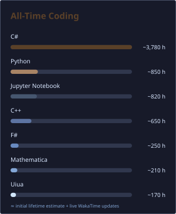
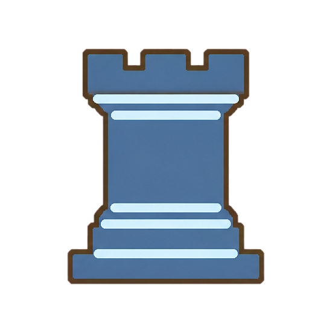
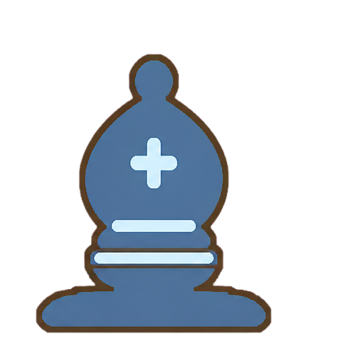
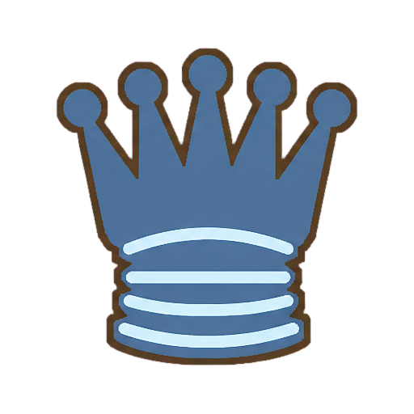
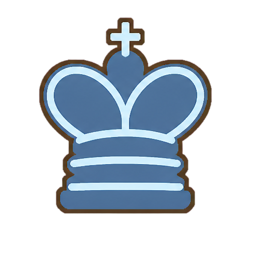
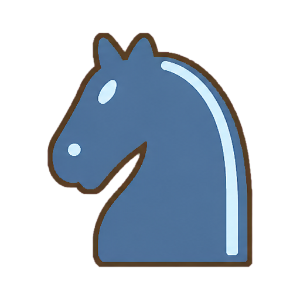
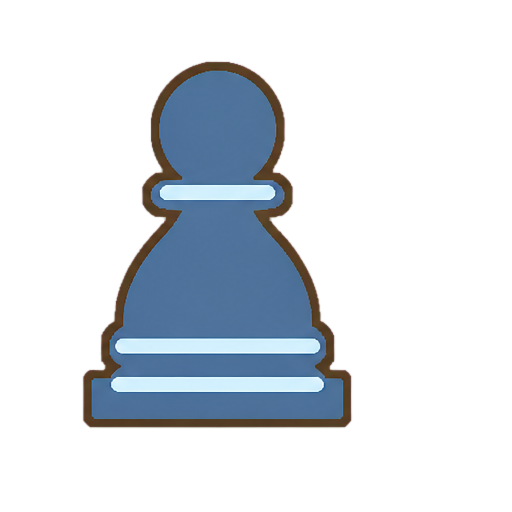
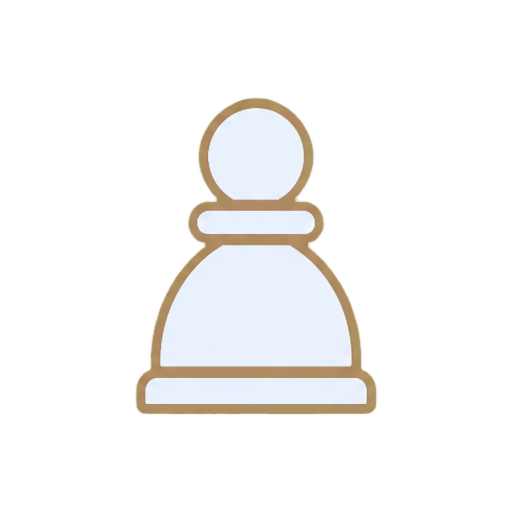
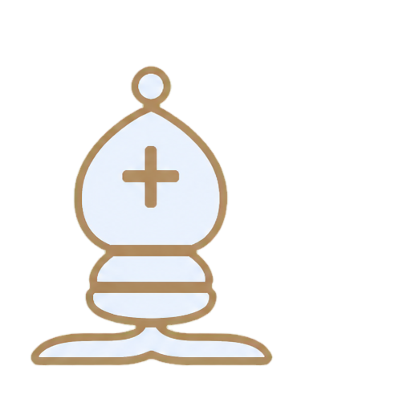
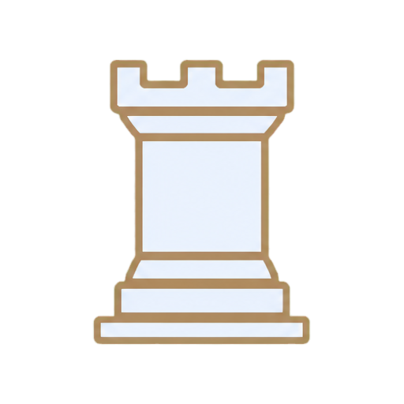

  
  
  
  
  
  
  

  
  
  
  
  
  
  

  
  
  
  
  
  
  

  
  
  
  
  

  
  
  
  
  
  

  
  
  
  

  
  
  

  
  

<!--

-->

  
  
  
  

  
  
  
  

  

  

<!--&include_repo=Ural_CS
-->
# Lets play Chess!
<!-- BEGIN CHESS BOARD -->
|   | A | B | C | D | E | F | G | H |   |
|---|:-:|:-:|:-:|:-:|:-:|:-:|:-:|:-:|:-:|
| **8** |  |  |  |  |  |  |  |  | **8** |
| **7** |  |  |  |  |  |  |  |  | **7** |
| **6** |  |  |  |  |  |  |  |  | **6** |
| **5** |  |  |  |  |  |  |  |  | **5** |
| **4** |  |  |  |  |  |  |  |  | **4** |
| **3** |  |  |  |  |  |  |  |  | **3** |
| **2** |  |  |  |  |  |  |  |  | **2** |
| **1** |  |  |  |  |  |  |  |  | **1** |
|   | **A** | **B** | **C** | **D** | **E** | **F** | **G** | **H** |   |
<!-- END CHESS BOARD -->

**It's your turn to move! Choose one from the following table by clicking a linked move, them just submitt the issue without changing anything!**
**And you're goog to go!**
<!-- BEGIN MOVES LIST -->
|  FROM  | TO (Just click a link!) |
| :----: | :---------------------- |
| **A8** | [A5](https://github.com/RusMermaid/RusMermaid/issues/new?body=Please+do+not+change+the+title.+Just+click+%22Submit+new+issue%22.+You+don%27t+need+to+do+anything+else+%3AD&title=Chess%3A+Move+A8+to+A5), [A6](https://github.com/RusMermaid/RusMermaid/issues/new?body=Please+do+not+change+the+title.+Just+click+%22Submit+new+issue%22.+You+don%27t+need+to+do+anything+else+%3AD&title=Chess%3A+Move+A8+to+A6), [A7](https://github.com/RusMermaid/RusMermaid/issues/new?body=Please+do+not+change+the+title.+Just+click+%22Submit+new+issue%22.+You+don%27t+need+to+do+anything+else+%3AD&title=Chess%3A+Move+A8+to+A7), [B8](https://github.com/RusMermaid/RusMermaid/issues/new?body=Please+do+not+change+the+title.+Just+click+%22Submit+new+issue%22.+You+don%27t+need+to+do+anything+else+%3AD&title=Chess%3A+Move+A8+to+B8) |
| **B5** | [B4](https://github.com/RusMermaid/RusMermaid/issues/new?body=Please+do+not+change+the+title.+Just+click+%22Submit+new+issue%22.+You+don%27t+need+to+do+anything+else+%3AD&title=Chess%3A+Move+B5+to+B4) |
| **C6** | [C5](https://github.com/RusMermaid/RusMermaid/issues/new?body=Please+do+not+change+the+title.+Just+click+%22Submit+new+issue%22.+You+don%27t+need+to+do+anything+else+%3AD&title=Chess%3A+Move+C6+to+C5) |
| **C8** | [A6](https://github.com/RusMermaid/RusMermaid/issues/new?body=Please+do+not+change+the+title.+Just+click+%22Submit+new+issue%22.+You+don%27t+need+to+do+anything+else+%3AD&title=Chess%3A+Move+C8+to+A6), [B7](https://github.com/RusMermaid/RusMermaid/issues/new?body=Please+do+not+change+the+title.+Just+click+%22Submit+new+issue%22.+You+don%27t+need+to+do+anything+else+%3AD&title=Chess%3A+Move+C8+to+B7), [D7](https://github.com/RusMermaid/RusMermaid/issues/new?body=Please+do+not+change+the+title.+Just+click+%22Submit+new+issue%22.+You+don%27t+need+to+do+anything+else+%3AD&title=Chess%3A+Move+C8+to+D7), [E6](https://github.com/RusMermaid/RusMermaid/issues/new?body=Please+do+not+change+the+title.+Just+click+%22Submit+new+issue%22.+You+don%27t+need+to+do+anything+else+%3AD&title=Chess%3A+Move+C8+to+E6), [F5](https://github.com/RusMermaid/RusMermaid/issues/new?body=Please+do+not+change+the+title.+Just+click+%22Submit+new+issue%22.+You+don%27t+need+to+do+anything+else+%3AD&title=Chess%3A+Move+C8+to+F5), [G4](https://github.com/RusMermaid/RusMermaid/issues/new?body=Please+do+not+change+the+title.+Just+click+%22Submit+new+issue%22.+You+don%27t+need+to+do+anything+else+%3AD&title=Chess%3A+Move+C8+to+G4), [H3](https://github.com/RusMermaid/RusMermaid/issues/new?body=Please+do+not+change+the+title.+Just+click+%22Submit+new+issue%22.+You+don%27t+need+to+do+anything+else+%3AD&title=Chess%3A+Move+C8+to+H3) |
| **D8** | [A5](https://github.com/RusMermaid/RusMermaid/issues/new?body=Please+do+not+change+the+title.+Just+click+%22Submit+new+issue%22.+You+don%27t+need+to+do+anything+else+%3AD&title=Chess%3A+Move+D8+to+A5), [B6](https://github.com/RusMermaid/RusMermaid/issues/new?body=Please+do+not+change+the+title.+Just+click+%22Submit+new+issue%22.+You+don%27t+need+to+do+anything+else+%3AD&title=Chess%3A+Move+D8+to+B6), [C7](https://github.com/RusMermaid/RusMermaid/issues/new?body=Please+do+not+change+the+title.+Just+click+%22Submit+new+issue%22.+You+don%27t+need+to+do+anything+else+%3AD&title=Chess%3A+Move+D8+to+C7), [D6](https://github.com/RusMermaid/RusMermaid/issues/new?body=Please+do+not+change+the+title.+Just+click+%22Submit+new+issue%22.+You+don%27t+need+to+do+anything+else+%3AD&title=Chess%3A+Move+D8+to+D6), [D7](https://github.com/RusMermaid/RusMermaid/issues/new?body=Please+do+not+change+the+title.+Just+click+%22Submit+new+issue%22.+You+don%27t+need+to+do+anything+else+%3AD&title=Chess%3A+Move+D8+to+D7) |
| **E7** | [E6](https://github.com/RusMermaid/RusMermaid/issues/new?body=Please+do+not+change+the+title.+Just+click+%22Submit+new+issue%22.+You+don%27t+need+to+do+anything+else+%3AD&title=Chess%3A+Move+E7+to+E6) |
| **E8** | [D7](https://github.com/RusMermaid/RusMermaid/issues/new?body=Please+do+not+change+the+title.+Just+click+%22Submit+new+issue%22.+You+don%27t+need+to+do+anything+else+%3AD&title=Chess%3A+Move+E8+to+D7) |
| **F7** | [F5](https://github.com/RusMermaid/RusMermaid/issues/new?body=Please+do+not+change+the+title.+Just+click+%22Submit+new+issue%22.+You+don%27t+need+to+do+anything+else+%3AD&title=Chess%3A+Move+F7+to+F5), [F6](https://github.com/RusMermaid/RusMermaid/issues/new?body=Please+do+not+change+the+title.+Just+click+%22Submit+new+issue%22.+You+don%27t+need+to+do+anything+else+%3AD&title=Chess%3A+Move+F7+to+F6) |
| **F8** | [G7](https://github.com/RusMermaid/RusMermaid/issues/new?body=Please+do+not+change+the+title.+Just+click+%22Submit+new+issue%22.+You+don%27t+need+to+do+anything+else+%3AD&title=Chess%3A+Move+F8+to+G7), [H6](https://github.com/RusMermaid/RusMermaid/issues/new?body=Please+do+not+change+the+title.+Just+click+%22Submit+new+issue%22.+You+don%27t+need+to+do+anything+else+%3AD&title=Chess%3A+Move+F8+to+H6) |
| **G6** | [G5](https://github.com/RusMermaid/RusMermaid/issues/new?body=Please+do+not+change+the+title.+Just+click+%22Submit+new+issue%22.+You+don%27t+need+to+do+anything+else+%3AD&title=Chess%3A+Move+G6+to+G5) |
| **G8** | [F6](https://github.com/RusMermaid/RusMermaid/issues/new?body=Please+do+not+change+the+title.+Just+click+%22Submit+new+issue%22.+You+don%27t+need+to+do+anything+else+%3AD&title=Chess%3A+Move+G8+to+F6), [H6](https://github.com/RusMermaid/RusMermaid/issues/new?body=Please+do+not+change+the+title.+Just+click+%22Submit+new+issue%22.+You+don%27t+need+to+do+anything+else+%3AD&title=Chess%3A+Move+G8+to+H6) |
| **H7** | [H5](https://github.com/RusMermaid/RusMermaid/issues/new?body=Please+do+not+change+the+title.+Just+click+%22Submit+new+issue%22.+You+don%27t+need+to+do+anything+else+%3AD&title=Chess%3A+Move+H7+to+H5), [H6](https://github.com/RusMermaid/RusMermaid/issues/new?body=Please+do+not+change+the+title.+Just+click+%22Submit+new+issue%22.+You+don%27t+need+to+do+anything+else+%3AD&title=Chess%3A+Move+H7+to+H6) |
<!-- END MOVES LIST -->

Having fun? Ask a friend to do the next move!

  
Last 5 moves in this game

<!-- BEGIN LAST MOVES -->

| Move | Author |
| :--: | :----- |
| `F1` to `E2` | [ @RusMermaid](https://github.com/RusMermaid) |
| `G7` to `G6` | [ @fiorin](https://github.com/fiorin) |
| `A2` to `A3` | [ @RusMermaid](https://github.com/RusMermaid) |
| `C7` to `C6` | [ @UltWolf](https://github.com/UltWolf) |
| `C3` to `D4` | [ @RusMermaid](https://github.com/RusMermaid) |

<!-- END LAST MOVES -->

 
  Visitors 
  

 
 
